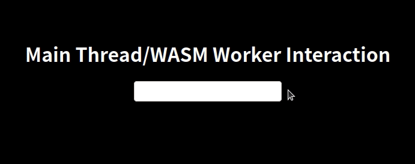

# Rust WASM Web Worker Examples

This repository contains four different examples of using web workers in conjunction with WASM in
Rust.

## Why web workers with WASM?
WASM (Web Assembly) is a great technology enabling developers to implement algorithms for the web in
modern compiled high level languages such as Rust. Developed applications can run at near-native
speed on the client side.

However, WASM currently has no built-in support for threads and direct parallel execution. Enter web
workers: By moving the heavy-lifting part of your application into web workers, they can run in
parallel to e.g. the code handling the user interaction. Background calculations will not slow down
the responsiveness of your page.

## Getting started with WASM and web workers
There are a few pitfalls on the way, and I personally struggled quite a bit due to limited
knowledge in JS. The first three examples in this repository all show different ways of combining
Rust WASM with web workers.

All examples can be built by running the `build.sh` in the example directory. To run them, you can
navigate to the `www` directory within the example and run e.g.
`python3 -m http.server --bind 127.0.0.1`.

## Which target to choose
- When compiling Rust to WASM without a bundler like `webpack`, I initially chose the option
  `--target web`, which is suggested and promoted. This creates ES modules for the compiled WASM
  code. While ES modules _in the main thread_ are supported by all modern browsers, [only Chrome
  supports importing ES modules in the scope of a web worker][Module import in dedicated worker]. Developing with Firefox and being 
  a rookie in JS, it took me a while to understand that I was not doing anything wrong but that it
  just was not supported.
- Luckily, Rust can still be compiled without creating modules by choosing `--target no-modules`.
  This requires loading the WASM code in a slightly different way and is also exemplified in
  three of the four examples.

## Where to spawn the worker
The worker can be spawned in JS, but then it becomes harder to do all the 'plumbing' to attach
callbacks in Rust to the worker. Instead, we can also use `web_sys` and spawn a worker from within
our Rust code that will be compiled to WASM.

## Examples
- The first example `wasm_module_js_worker` shows how Rust code is compiled to ES modules and how
  those generated modules can be loaded. Loading the module in the worker will only work in Chrome.
- The second example `wasm_no_modules_js_worker` demonstrates how to compile Rust code to WASM
  without creating modules and how to load this WASM code. This should work in all modern browsers.
- The third example `wasm_no_modules_wasm_worker` goes a step further and spawns the worker with
  `web_sys` directly in the Rust code.
- The fourth example `wasm_worker_interaction` is a minimal example to show how to spawn a web 
  worker from within Rust using `web_sys` and interact with it in a useful way. The code runs a
  small website with a text input field. Whenever the text field is changed, a callback sends the
  parsed data to a spawned worker which evaluates whether the number is even or odd and sends back
  the result to the main thread. The example is intentionally kept simple while showing several
  useful concepts (creating a worker in Rust, keeping state in a struct between calls, shared access
  to the worker from different callbacks). The image below shows the fourth example.

[Module import in dedicated worker]: https://wpt.fyi/results/workers/modules/dedicated-worker-import.any.html?label=master&product=chrome%5Bstable%5D&product=firefox%5Bstable%5D&product=safari%5Bstable%5D&product=chrome%5Bexperimental%5D&product=firefox%5Bexperimental%5D&product=safari%5Bexperimental%5D&aligned